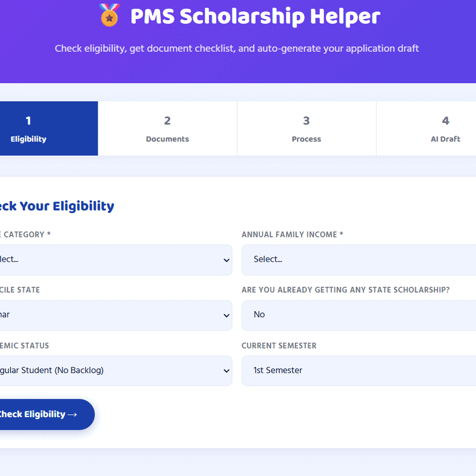

<div align="center">


# 🎓 College Student Portal
### Gaya College of Engineering — Bihar

**A feature-rich, AI-powered web portal built for engineering students.**  
From CGPA calculations to AI-generated resumes — everything a GCE student needs, in one place.

---

[](https://developer.mozilla.org/en-US/docs/Web/HTML)
[](https://developer.mozilla.org/en-US/docs/Web/CSS)
[](https://developer.mozilla.org/en-US/docs/Web/JavaScript)
[](https://www.anthropic.com)
[](LICENSE)
[]()
[](CONTRIBUTING.md)

<br/>

[🌐 Live Demo](#) · [🐛 Report a Bug](https://github.com/Satyam-GitDotCom/College-student-portal/issues/new) · 
[💡 Request a Feature](https://github.com/Satyam-GitDotCom/College-student-portal/issues/new)

</div>

---

## 🎥 Portal Demo

<p align="center">
  
</p>

---

## 📌 Table of Contents

- [About the Project](#-about-the-project)
- [Features](#-features)
- [Tech Stack](#-tech-stack)
- [Project Structure](#-project-structure)
- [Getting Started](#-getting-started)
- [Pages Overview](#-pages-overview)
- [AI Integration](#-ai-integration)
- [Roadmap](#-roadmap)
- [Contributing](#-contributing)
- [License](#-license)
- [Acknowledgements](#-acknowledgements)

---

## 🏫 About the Project

The **GCE Student Portal** is an all-in-one web application designed specifically for students of **Gaya College of Engineering (GCE)**, Bihar — a government engineering institute established in 1982 under the Department of Science & Technology, Bihar.

This portal bridges the gap between institutional information and student productivity tools, combining static college information with powerful, **AI-driven utilities** — all in a single, no-install, browser-based application.

> Built as a college project, this portal demonstrates the real-world application of front-end web development and AI API integration to solve genuine student problems.

**Who is this for?**

- 🎓 GCE students who need CGPA tracking, study scheduling, or placement prep
- 📋 Students applying for PMS (Post Matric Scholarship) who need guidance
- 💼 Final-year students building their first professional resume
- 🏫 Prospective students exploring the college before applying

---

## ✨ Features

| Feature | Description | AI-Powered |
|---|---|---|
| 📊 **CGPA Calculator** | SGPA/CGPA calculation, percentage conversion, backlog tracking & placement eligibility check | ❌ |
| 📄 **AI Resume Builder** | ATS-friendly engineering resume generated using Claude AI from your inputs | ✅ |
| 🏅 **PMS Scholarship Helper** | Eligibility checker, document checklist & auto-generated application letter | ✅ |
| 🎯 **Placement Readiness Quiz** | 10-question quiz with a personalized AI action plan based on your results | ✅ |
| 📅 **Exam Timetable Generator** | Smart, AI-crafted study schedule based on your exam dates and daily availability | ✅ |
| 🗺️ **Campus Map & Forum** | Interactive campus map with an anonymous doubt forum powered by AI answers | ✅ |
| 💬 **GCE AI Chatbot** | Floating AI assistant for answering queries about admissions, hostel, departments & more | ✅ |
| 🌙 **Dark Mode** | Full light/dark theme toggle persisted across sessions | ❌ |
| 🇮🇳 **Bilingual Support** | Complete Hindi/English language toggle across the homepage | ❌ |
| 📢 **Live Notice Ticker** | Scrolling announcement banner for exams, placements, scholarships | ❌ |

---

## 🛠 Tech Stack

**Frontend**


**Fonts & Icons**


— Baloo 2 & Hind (optimized for bilingual Hindi/English display)

**AI Backend**


— `claude-sonnet` model via the Anthropic Messages API

**Deployment**


— Zero-dependency static hosting, no build step required

> **No frameworks. No bundlers. No node_modules.**  
> This project runs entirely in the browser — just open `index.html`.

---

## 📁 Project Structure

```
College-student-portal/
│
├── index.html          # Main homepage — hero, stats, info cards, chatbot, tools hub
├── cgpa.html           # CGPA / SGPA calculator with multi-semester support
├── resume.html         # AI-powered resume builder (Claude API)
├── pms.html            # PMS Scholarship eligibility helper (Claude API)
├── placement.html      # Placement readiness quiz + AI action plan (Claude API)
├── timetable.html      # Exam timetable & study schedule generator (Claude API)
├── campus.html         # Campus map + anonymous AI-powered doubt forum
│
├── style.css           # Global stylesheet — themes, layout, components
└── script.js           # Shared JavaScript — theme toggle, language switch, chatbot logic
```

> Each HTML page is **self-contained** — inline styles and scripts are used in tool pages to keep them portable and independently deployable.

---

## 🚀 Getting Started

### Prerequisites

- A modern web browser (Chrome, Firefox, Edge, Safari)
- An **Anthropic API key** (required for all AI-powered tools)
- No Node.js, no package manager, no build tools required

### Installation

**1. Clone the repository**

```bash
git clone https://github.com/NoPatchForLife/College-student-portal.git
cd College-student-portal
```

**2. Open the portal**

Simply open `index.html` in your browser:

```bash
# On macOS
open index.html

# On Linux
xdg-open index.html

# On Windows
start index.html
```

Or serve it locally with any static file server:

```bash
# Using Python
python -m http.server 8000

# Using Node.js (npx)
npx serve .
```

Then navigate to `http://localhost:8000`

**3. Configure your API key**

The AI-powered tools (Resume Builder, PMS Helper, Placement Quiz, Timetable Generator, Chatbot) require an Anthropic API key.

> ⚠️ **Security Note:** This project currently accepts the API key via an in-page input field. This is appropriate for personal/local use. **Never commit your API key to the repository.** For production deployment, move API calls to a backend proxy.

---

## 📄 Pages Overview

### `index.html` — Home
The landing page for the portal. Includes:
- Animated hero section with bilingual (EN/HI) content
- Live scrolling notice ticker
- Animated statistics counters (students, faculty, placements)
- Information cards (Admissions, Departments, Hostel, Placements, Library, Scholarships)
- Floating AI chatbot widget with quick-reply suggestions and voice input
- Tools hub grid linking to all student utilities

### `cgpa.html` — CGPA Calculator
A fully client-side grade calculator with three modes:
- **SGPA Mode** — single semester, add/remove subjects, grade-point lookup
- **CGPA Mode** — multi-semester, add/remove semesters dynamically
- **Grade Converter** — CGPA ↔ percentage, plus a complete grade reference table

Results include: SGPA/CGPA score, equivalent percentage, backlog count, overall grade, and eligibility flags for TCS, Wipro, Infosys, PMS Scholarship, Merit Scholarship, and Distinction.

### `resume.html` — AI Resume Builder
Students input their details (name, branch, skills, projects, etc.) and Claude AI generates a clean, ATS-optimized engineering resume in seconds.

### `pms.html` — PMS Scholarship Helper
Guides SC/ST/BC/EBC students through the Post Matric Scholarship process. Checks eligibility criteria, displays a required documents checklist, and uses Claude AI to auto-generate a formal application letter.

### `placement.html` — Placement Readiness
A 10-question quiz assessing a student's placement preparedness across DSA, projects, communication, resume quality, and more. Claude AI analyzes the score and generates a personalized preparation action plan.

### `timetable.html` — Exam Timetable Generator
Students enter their exam subjects, dates, and daily available study hours. Claude AI constructs an optimized day-by-day study schedule with subject prioritization.

### `campus.html` — Campus Map & Forum
An interactive map of the GCE campus with key locations marked. Features an anonymous student doubt forum where Claude AI provides answers to posted questions.

---

## 🤖 AI Integration

All AI features in this portal are powered by the **Anthropic Claude API** (`claude-sonnet` model).

**How it works:**

```javascript
const response = await fetch("https://api.anthropic.com/v1/messages", {
  method: "POST",
  headers: {
    "Content-Type": "application/json",
    "x-api-key": userApiKey,
    "anthropic-version": "2023-06-01",
    "anthropic-dangerous-direct-browser-access": "true"
  },
  body: JSON.stringify({
    model: "claude-sonnet-20241022",
    max_tokens: 1024,
    messages: [{ role: "user", content: prompt }]
  })
});
```

**AI-Powered Features Summary:**

| Page | Prompt Purpose | Output |
|---|---|---|
| `index.html` | General GCE Q&A chatbot | Conversational answer |
| `resume.html` | Resume generation from student data | Formatted resume text |
| `pms.html` | Application letter drafting | Formal Hindi/English letter |
| `placement.html` | Quiz result analysis | Personalized action plan |
| `timetable.html` | Study schedule creation | Day-by-day schedule |
| `campus.html` | Student doubt answering | Direct AI answer |

> 📝 **Note:** The API key is entered by the user at runtime and is never stored server-side. All API calls are made directly from the browser.

---

## 🗺 Roadmap

- [x] Homepage with bilingual support and dark mode
- [x] CGPA/SGPA calculator with eligibility checks
- [x] AI Resume Builder (Claude API)
- [x] PMS Scholarship Helper (Claude API)
- [x] Placement Readiness Quiz (Claude API)
- [x] Exam Timetable Generator (Claude API)
- [x] Campus Map & AI Doubt Forum
- [ ] Student login & profile persistence (localStorage / Firebase)
- [ ] Downloadable PDF resume export
- [ ] Push notifications for exam/placement alerts
- [ ] Department-specific notice boards
- [ ] Alumni network & mentorship connect section
- [ ] Mobile PWA (Progressive Web App) support
- [ ] Backend proxy for secure API key handling

> Want to contribute to any of these? See [Contributing](#-contributing).

---

## 🤝 Contributing

Contributions are what make open source great. Any contribution — bug fixes, UI improvements, new features, or documentation — is warmly welcome.

**Steps to contribute:**

1. **Fork** the repository
2. **Create** your feature branch
   ```bash
   git checkout -b feature/your-feature-name
   ```
3. **Commit** your changes with a clear message
   ```bash
   git commit -m "feat: add PDF export for resume builder"
   ```
4. **Push** to your branch
   ```bash
   git push origin feature/your-feature-name
   ```
5. **Open a Pull Request** against the `main` branch

**Before submitting:**
- Test your changes in at least Chrome and Firefox
- Make sure the page still works without an API key (graceful degradation)
- Keep inline styles/scripts consistent with the existing approach
- Reference any related issue in your PR description

For larger changes, please open an issue first to discuss your proposal.

---

## 📜 License

Distributed under the **MIT License**. See [`LICENSE`](LICENSE) for full terms.

```
MIT License — You are free to use, copy, modify, and distribute this project
with attribution. No warranty is provided.
```

---

## 🙏 Acknowledgements

- **[Gaya College of Engineering](https://gcekh.ac.in/)** — Gaya, Bihar (Est. 1982) — the institution this portal was built for
- **[Anthropic](https://www.anthropic.com)** — for the Claude AI API powering all intelligent features
- **[Google Fonts](https://fonts.google.com)** — Baloo 2 and Hind typefaces used throughout the UI
- **Original project** forked from [@chandan-rajak/college_web_project](https://github.com/chandan-rajak/college_web_project)
- All GCE students whose real-world needs shaped the features of this portal

---

<div align="center">

Made with ❤️ for GCE students

**[⬆ Back to Top](#-college-student-portal)**

</div>
